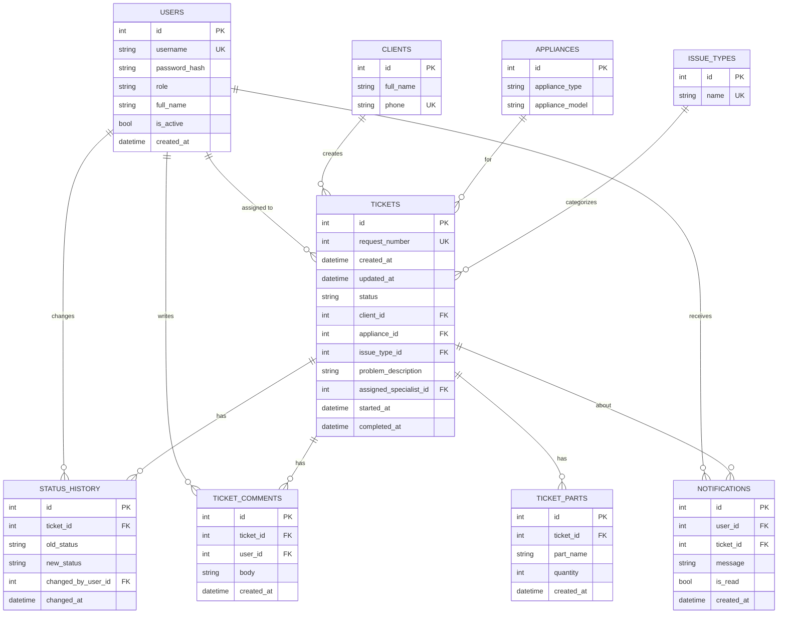

# Задание 2 — ER-диаграмма (3НФ)

Ниже ER-диаграмма в Mermaid-формате (удобно просматривать и экспортировать в изображение).

```mermaid
erDiagram
  USERS {
    int id PK
    string username UK
    string password_hash
    string role
    string full_name
    bool is_active
    datetime created_at
  }

  CLIENTS {
    int id PK
    string full_name
    string phone UK
  }

  APPLIANCES {
    int id PK
    string appliance_type
    string appliance_model
  }

  ISSUE_TYPES {
    int id PK
    string name UK
  }

  TICKETS {
    int id PK
    int request_number UK
    datetime created_at
    datetime updated_at
    string status
    int client_id FK
    int appliance_id FK
    int issue_type_id FK
    string problem_description
    int assigned_specialist_id FK
    datetime started_at
    datetime completed_at
  }

  STATUS_HISTORY {
    int id PK
    int ticket_id FK
    string old_status
    string new_status
    int changed_by_user_id FK
    datetime changed_at
  }

  TICKET_COMMENTS {
    int id PK
    int ticket_id FK
    int user_id FK
    string body
    datetime created_at
  }

  TICKET_PARTS {
    int id PK
    int ticket_id FK
    string part_name
    int quantity
    datetime created_at
  }

  NOTIFICATIONS {
    int id PK
    int user_id FK
    int ticket_id FK
    string message
    bool is_read
    datetime created_at
  }

  USERS ||--o{ TICKETS : "assigned to"
  USERS ||--o{ STATUS_HISTORY : "changes"
  USERS ||--o{ TICKET_COMMENTS : "writes"
  USERS ||--o{ NOTIFICATIONS : "receives"

  CLIENTS ||--o{ TICKETS : "creates"
  APPLIANCES ||--o{ TICKETS : "for"
  ISSUE_TYPES ||--o{ TICKETS : "categorizes"

  TICKETS ||--o{ STATUS_HISTORY : "has"
  TICKETS ||--o{ TICKET_COMMENTS : "has"
  TICKETS ||--o{ TICKET_PARTS : "has"
  TICKETS ||--o{ NOTIFICATIONS : "about"
```

Схема БД (DDL для SQLite) — `repair_requests/schema.sql`.

