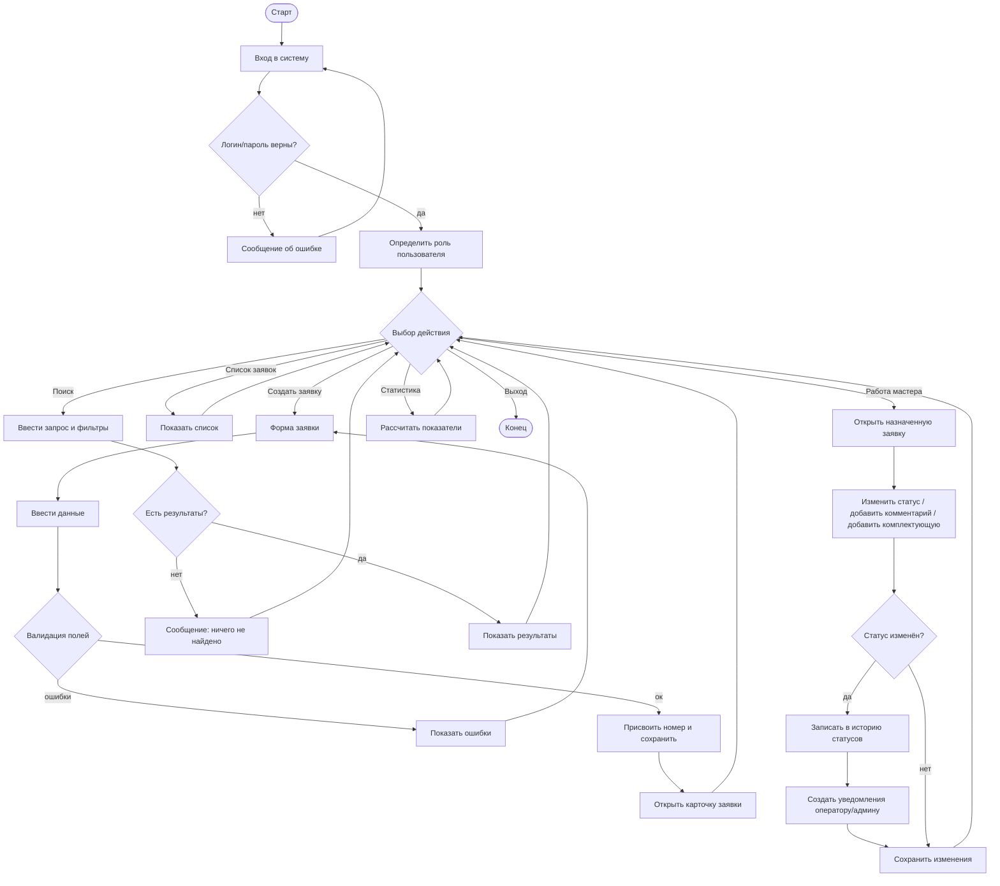
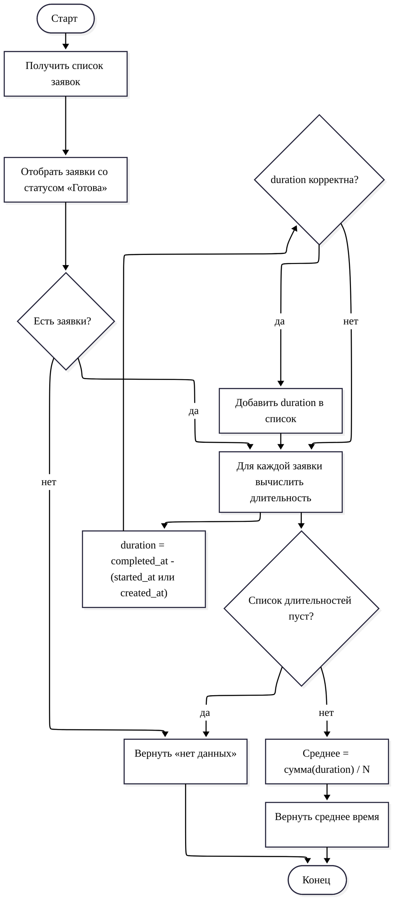

# Задание 1 — алгоритмы (Mermaid)

## Основной алгоритм учета заявок

```mermaid
flowchart TD
  A([Старт]) --> B[Вход в систему]
  B --> C{Логин/пароль верны?}
  C -- нет --> C1[Сообщение об ошибке] --> B
  C -- да --> D[Определить роль пользователя]
  D --> E{Выбор действия}

  E -->|Создать заявку| F[Форма заявки]
  F --> G[Ввести данные]
  G --> H{Валидация полей}
  H -- ошибки --> H1[Показать ошибки] --> F
  H -- ок --> I[Присвоить номер и сохранить]
  I --> J[Открыть карточку заявки]
  J --> E

  E -->|Список заявок| K[Показать список]
  K --> E

  E -->|Поиск| L[Ввести запрос и фильтры]
  L --> M{Есть результаты?}
  M -- нет --> M1[Сообщение: ничего не найдено] --> E
  M -- да --> N[Показать результаты] --> E

  E -->|Работа мастера| W[Открыть назначенную заявку]
  W --> X[Изменить статус / добавить комментарий / добавить комплектующую]
  X --> Y{Статус изменён?}
  Y -- да --> Y1[Записать в историю статусов]
  Y1 --> Y2[Создать уведомления оператору/админу]
  Y2 --> Z[Сохранить изменения]
  Y -- нет --> Z
  Z --> E

  E -->|Статистика| S[Рассчитать показатели]
  S --> E

  E -->|Выход| Q([Конец])
```

## Детализация функции «Среднее время ремонта»

```mermaid
%%{init: { "theme": "redux", "themeVariables": { "fontFamily": "", "fontSize": "20px", "primaryTextColor": "#000", "primaryBorderColor": "#000", "lineColor": "#000", "secondaryColor": "#000", "edgeLabelBackground": "#FFF" }, "flowchart": { "nodeSpacing": 12, "rankSpacing": 12, "padding": 16 }, "layout": "elk", "look": "neo" }}%%
flowchart TD
  A([Старт]) --> B[Получить список заявок]
  B --> C[Отобрать заявки со статусом «Готова»]
  C --> D{Есть заявки?}
  D -- нет --> E[Вернуть «нет данных»] --> Z([Конец])
  D -- да --> F[Для каждой заявки вычислить длительность]
  F --> G["duration = completed_at - (started_at или created_at)"]
  G --> H{duration корректна?}
  H -- нет --> F
  H -- да --> I[Добавить duration в список]
  I --> F
  F --> J{Список длительностей пуст?}
  J -- да --> E
  J -- нет --> K["Среднее = сумма(duration) / N"]
  K --> L[Вернуть среднее время]
  L --> Z

```

